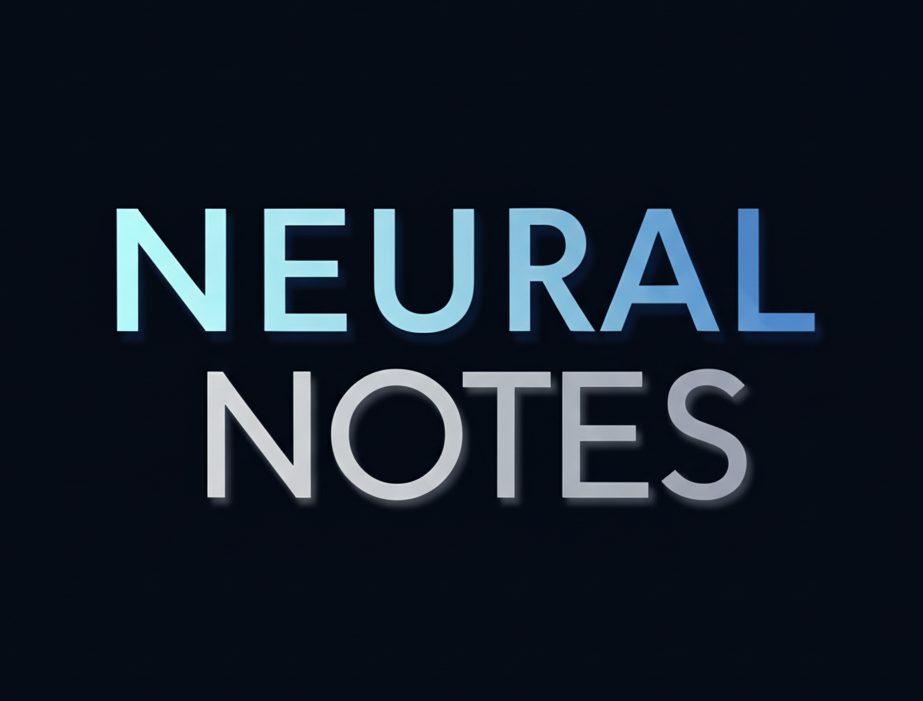

Welcome to Neural Notes

{ height=500px }

Hi, I’m a data scientist with a deep curiosity for both data and science. I started this blog as a personal learning space — a place to explore new ideas, share what I’m discovering, and grow along the way.

Neural Notes isn’t just a collection of posts — it’s my digital lab notebook. I'm learning in public, and I’d love to learn with you.

If you're reading any of my posts, feel free to share your thoughts, suggestions, or corrections. Your feedback helps me improve — and maybe together, we can all get a little better at this data game.

Let’s explore, experiment, and evolve — one post at a time.

## About Me

I work across the stack of data science — from exploring raw data to building machine learning models, analyzing fraud, experimenting with LLMs, and writing code in both Python and R. I enjoy solving real-world problems, especially the messy ones.

This blog is my personal space to learn, reflect, and grow — not just as a professional, but as someone genuinely curious about data, systems, and how they shape our world.

Outside of work, I like exploring music (especially metal 🎸), building side projects, and occasionally getting lost in thought over coffee and code.

Thanks for stopping by. I hope you find something here that sparks your own curiosity.

## What You’ll Find Here

This blog is where I document what I’m learning and building, including:
- End-to-end machine learning projects
- Data science tools and tips in Python & R
- Thoughts on LLMs, model interpretability, and experimentation
- Side projects, visuals, and experiments

## Tools I Often Use

- Programming: Python, R, SQL
- ML & AI: scikit-learn, XGBoost, LightGBM, TensorFlow, Keras, transformers
- Visualization: ggplot2, matplotlib, seaborn, Plotly
- Platforms: Jupyter, RStudio, Streamlit, Shiny, MLflow, FastAPI

### Connect with Me

-   
-   
- 
